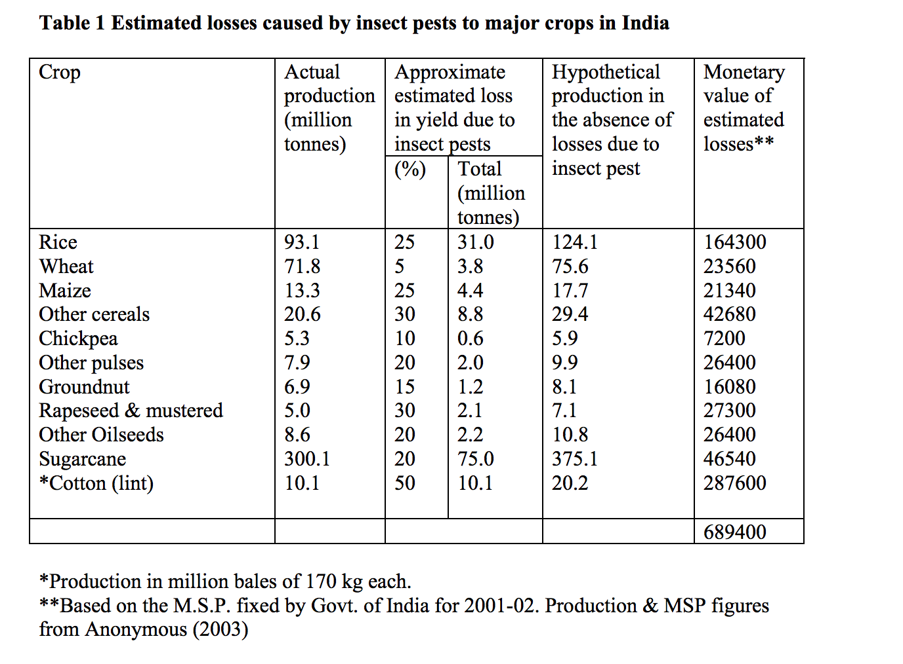
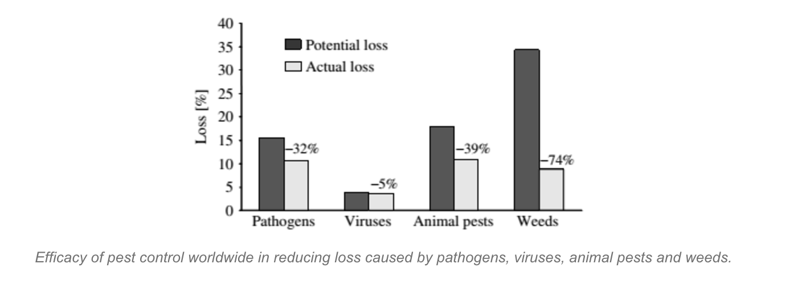
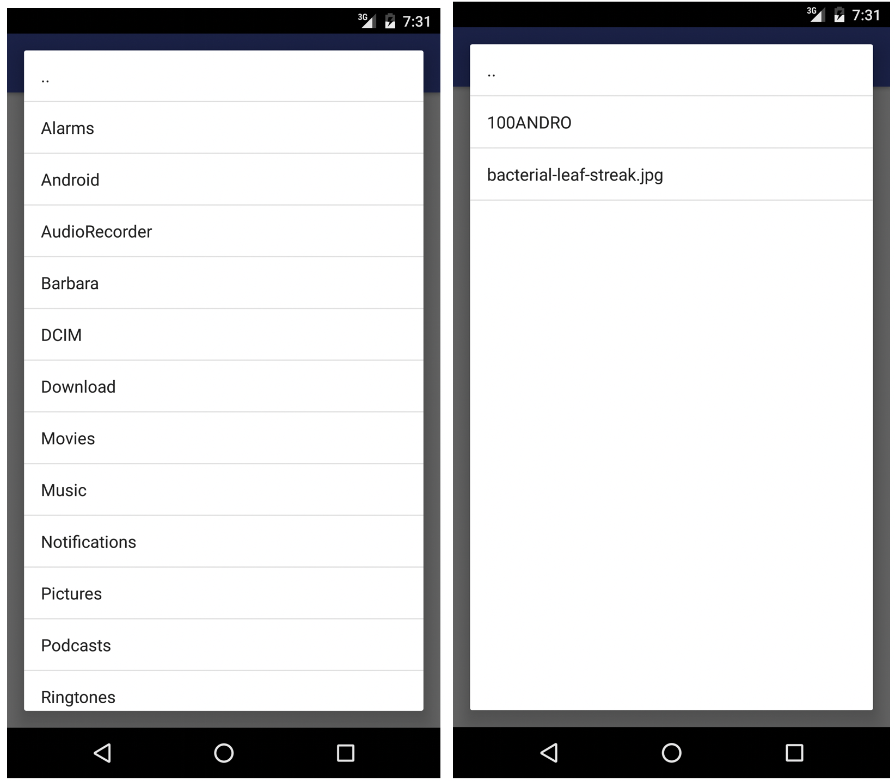
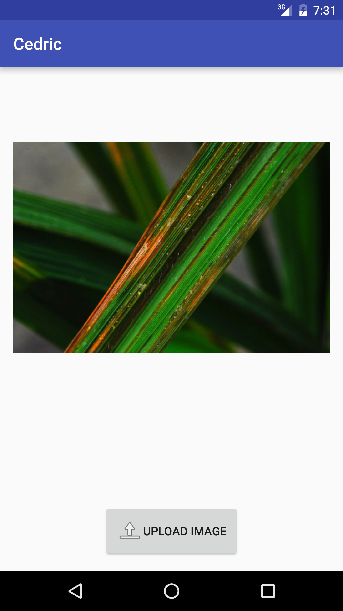
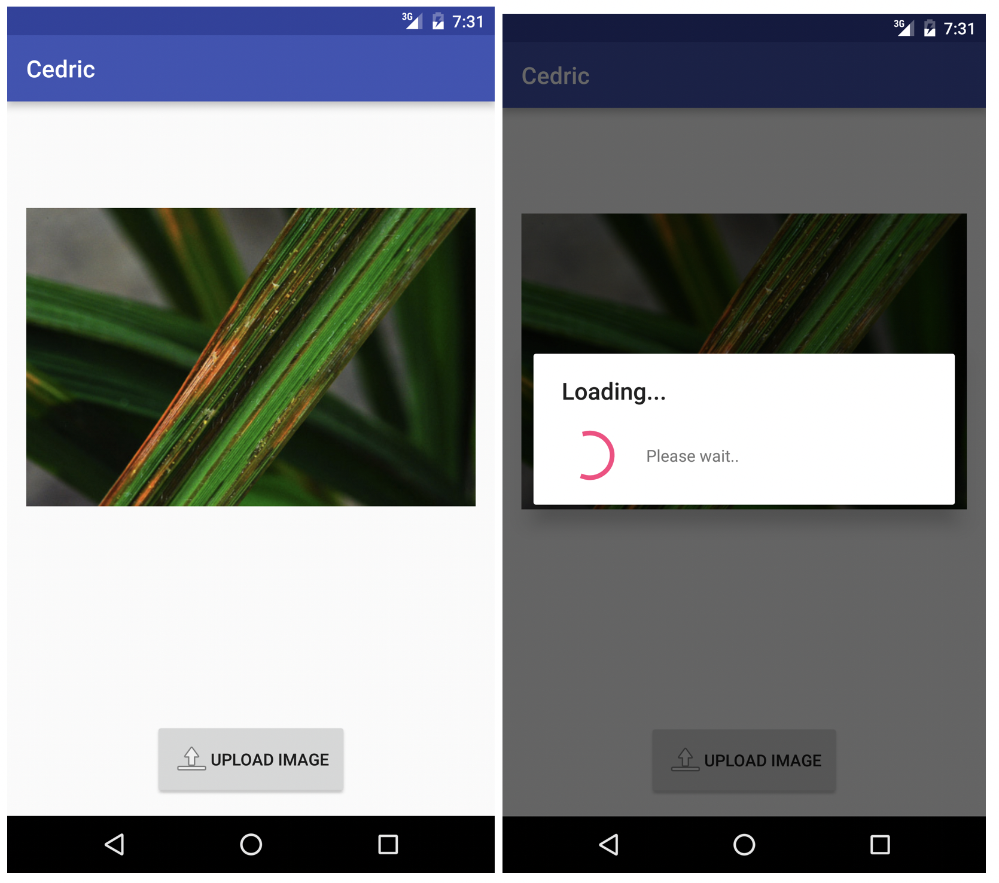
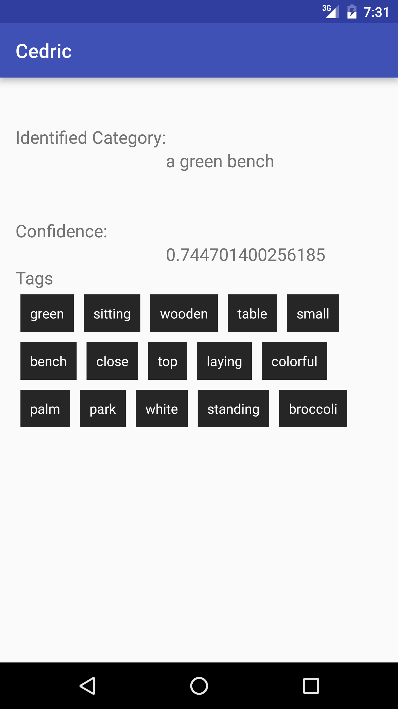

# Cedric - The Crop Inspector
## Introduction:
Agriculture is the backbone of Indian economy, they say.Despite Agriculture being the prime occupation of people in India, not all the latest technologies benefit those frames who help the agriculture prevail. Farming is no easy. Farming is a long time process which involves a lot of steps to successfully cultivate a crop. All crops have varied life cycle duration apart from the varied care they need at those life cycle stages. Growing a healthy crop is the prime goal of all farmers. It takes a lot of effort and care from the farmer to grow the crop healthy and perfect. Despite the care taken, there are often times when the crop gets affected by weird diseases due to various climatic and environmental factors.
## The proposed system:
The current system of disease identification involves an agriculturalist to inspect the disease and provide the appropriate cure for it. As it is a manual process, it involves a lot of time and hence the early preventive measures could not be followed for temporary prevention of the disease.

With technologies evolving over time, we live in a world of smart devices and cores of faster technologies. We propose a system that helps identify the disease that affected crops in the field and gives you the first stage disease identification that will help the farmer. This is a mobile app that helps the farmer by giving the first stage cure or temporary prevention of disease by letting him upload a picture of the infected crop.
## Technical details:
One touch solution for crop infection contamination. The farmer can pick up his phone, take a picture of the infected crop and send it to the server. The server with an appropriate level of Artificial intelligence can identify the disease or the possible diseases that will produce the same disease as the infection of the current crops and give a comprehended disinfection procedure that will help further contamination of the disease.
## Wireframes:
 Wireframe of the mobile app.

## Statistics:
The crop yield losses, on a field and during post-harvest period, caused by pests, diseases and weeds are of paramount importance. The crop losses due to pests, diseases and weeds are approximately assessed to be ranging between 10 to 30% of crop productions. If we consider, on an average, crop loss of 20%, and the present gross value of our agriculture produce as Rs, 7 lakh crore, the loss comes to Rs. 1,40,000 crore, which is colossal (Kumar and Gupta, 2012). Even if we could save 50% by using plant protection, it will add Rs. 70,000 of core additional income to our farmers.

## The existing way:
The current way of analysing the infected crops is a manual process. Usually a government crop inspector or the person who has knowledge on the crop should visit the farm field, take samples, analyze on the spot with his intelligence, if he finds the cause and the severity of the disease then he gives the first analysis report and the initial remedy, which is similar to the paracetamol that we take as initial step for the fever we have before visiting the doctor. If the crop inspector doesn't know about the disease or have no insecticides that cure the disease, this process will take around a week to provide a proper solution. Usually, these farms are not in or around where the agricultural inspection office is located, these offices are near urban areas where the farms are remotely rural, which means that the transportation will become more serious as the farm exists deep inside the geography. Transportation being a huge hurdle, the inspection of crops take around 2-3working days during which the infection of crops increases and becomes a huge irrecoverable loss, which could have been controlled if we have taken the paracetamol for the pest or disease.
## The proposed solution:
With technologies evolving over time, it is high time we put them to good use for farmers who feed the entire nation. The proposed system majorly uses the combination of machine learning, cognitive solution and data intelligence techniques to inspect the crops and provide the initial analysis report and remedy. Here I explain how the system I propose is capable of doing what I say, it is. I briefly describe what these technologies are, and how are these technologies helping me to achieve the solution.
### Cognitive solutions:
 Cognitive computing is the simulation of human thought processes in a computerised model. Cognitive computing involves self-learning systems that use data mining, pattern recognition and natural language processing to mimic the way the human brain works. The goal of cognitive computing is to create automated IT systems that are capable of solving problems without requiring human assistance.
### Machine learning and data intelligence:
Cognitive computing systems use machine learning algorithms. Such systems continually acquire knowledge from the data fed into them by mining data for information. The systems refine the way they look for patterns and as well as the way they process data so they become capable of anticipating new problems and modelling possible solutions.

 Machine learning is closely related to (and often overlaps with) computational statistics; a discipline which also focuses in prediction-making through the use of computers. It has strong ties to mathematical optimisation, matrix theory, linear algebra, and copulas, which delivers methods, theory and application domains to the field. Machine learning is employed in a range of computing tasks where designing and programming explicit algorithms are unfeasible.
### Why I say, this two help solving our problem?
 With the cognitive technology, we can train the system on a particular domain, here vegetation and crops management, which will involve feeding infected crop images, along with metadata such as classification of the disease and the severity. On doing so we involve machine learning to use the unstructured data such as image or file containing the crop pathogens information. Yes, this requires some time to initially setup data, train the system with machine learning algorithms and get the desired output for varying crops and their pathogens. However, it is a one-time process that only involves very less work in case there are new sample to pathogens need to be added.

There are various cognitive solutions in the world right now. I’ve listed the popular ones below. You can try to look into their image classification and description methodologies in the adjacent links.

- Microsoft  Cognitive solutions - Vision API - sample domain-based classification demo for celebrities. https://www.microsoft.com/cognitive-services/en-us/computer-vision-api
- Alchemy Vision(Acquired by IBM now) - http://www.ibm.com/watson/developercloud/alchemyvision/api/v1/#imagegetrankedimagefacetags
- IBM Watson - Visual recognition API - http://visual-recognition-demo.mybluemix.net/

## The Prototype:
The following are the limitations in the prototype I’ve built. Among the top visual recognition API provider, I chose Microsoft because it is developer friendly, they are in their preview stage and the API has a decent amount of API usage limits. As I have mentioned in the previous section, machine learning is a time extensive process. All of the three providers require extensive training when it comes to domain-based classification and description system. If you have seen Microsoft’s face recognition end point, this is a clear example of domain-specific classification and description mechanism. Right now Microsoft only made this Celebrity domain classification as public. However, we can purchase a license for our own domain to classify, which is vegetation and pathology. This applies to IBM Watson as well, it requires a license to train their system with various machine learning techniques along with intensive metadata and information around the images/content. These systems are assured to be intelligent in the way that they learn incrementally but constantly, such that you need not repeat certain things over and over.
### Explain why you have not implemented what you have said above?
With that being said, I’ve only used the generic classification system provided by Microsoft to describe the image I feed into the system. The description will not be more specific, they’ll be naive in most of the cases. I believed the purpose of the prototype is to illustrate my thought process and not to build a production ready analytical system. I’ve explained the screen wise features of the prototype in the forthcoming sections.

## Block Diagram:

## The prototype walkthrough:
### Home:
This is the landing screen of the App which has two options, one to choose a file from the file system and another to capture a new picture through a camera. The “choose file dialogue” is a simple list view which has directories and files listed in order.

### File chooser dialog:
This view can be obtained by clicking the “choose file” button. This dialogue lists the list of available folders, followed by the list of all images having valid image formats.

### Image capture view:
This view lets you capture raw images instantly and send it for analysis. The user can land in this view by clicking the “Capture image” button in the home screen. This view makes use of the CameraPreview feature to actually capture a live image. The user will be landed in the “Preview image” view on clicking the capture image button.

### Image preview view:
This is an intermediary view to preview the captured or chosen image file before uploading it for analysis. This page lets you change if the image was chosen or captured is not clear or correct. Once the user previews the right image, he can click on the upload button to send to for analysis.

### The Results view:
This is the view which is intended to display the analysis result of the vegetation domain specific image. As this is a prototype I’ve displayed the naive result of the system which has not undergone any “vegetation-domain” specific training on series of images.

## Tech stack and References:
### Android:

- https://developer.android.com/design/material/index.html
- http://square.github.io/retrofit/
- https://androidkennel.org/android-camera-access-tutorial/
- http://stacktips.com/tutorials/android/how-to-create-custom-layout-in-android-by-extending-viewgroup-class

### Microsoft Cognitive Services:

- https://www.microsoft.com/cognitive-services/en-us/computer-vision-api

### Diagrams tool:

- https://www.draw.io

### Statistics:

- http://ipsdis.org/
- http://lsetyobudi.lecture.ub.ac.id/files/2013/04/Pert-2-Crop-Loss-Assessment.pdf
- http://spiru.cgahr.ksu.edu/proj/iwcspp/pdf2/2/29.pdf
- http://www.annualreviews.org/doi/abs/10.1146/annurev.py.23.090185.002323?journalCode=phyto
